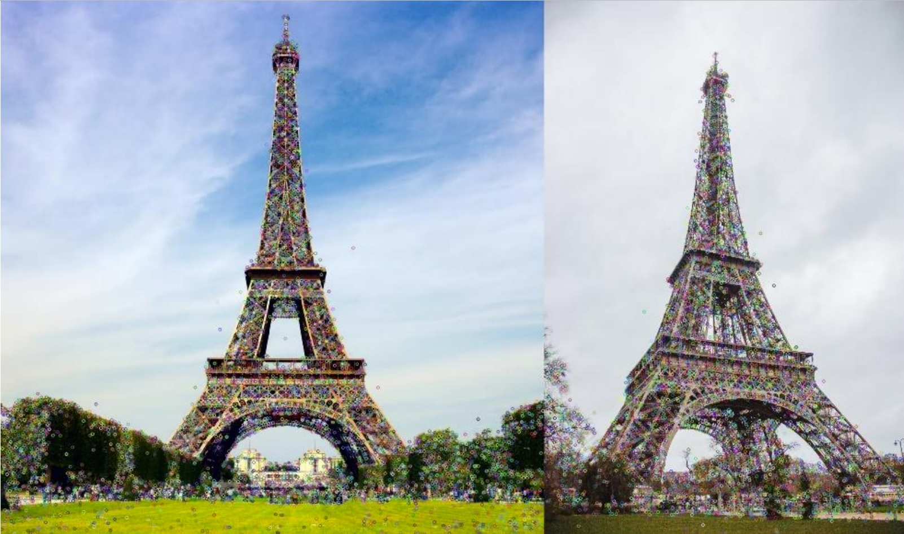
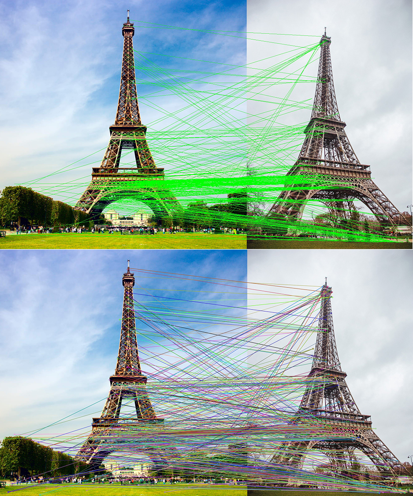
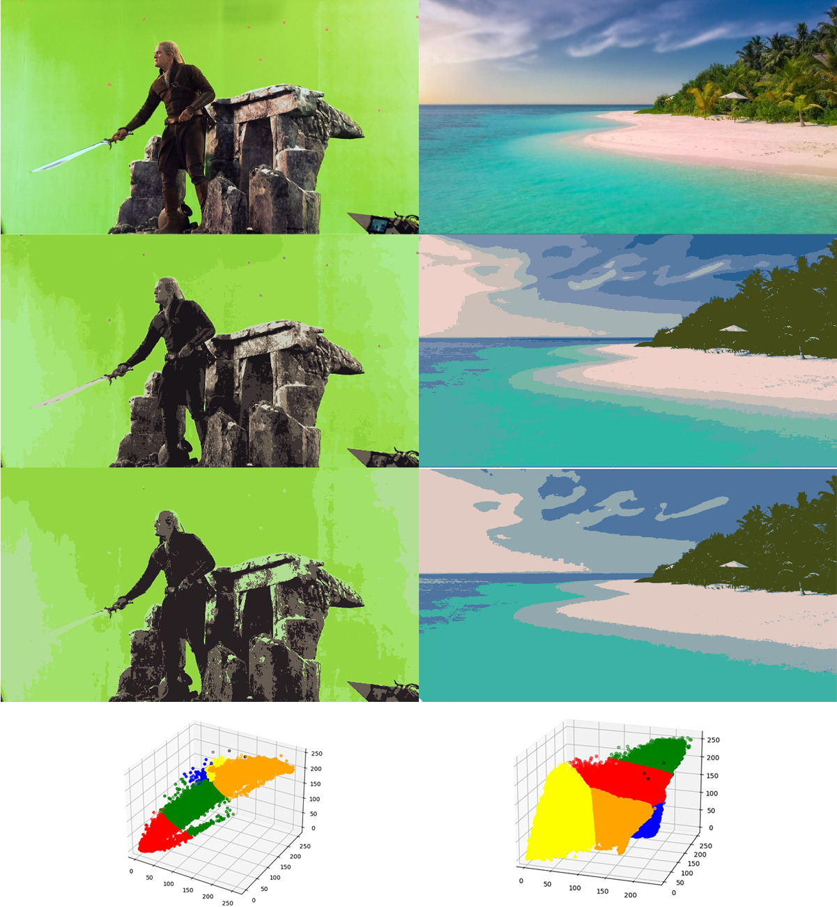

# Image-Clustering-and-Comparison

Image Comparison Using SIFT and KNN

This project was designed to take two images of the same object from different angles and identify corresponding points between the images. This was done in a two part process, first key points in the image were identified for comparison which would be done using OpenCV's built-in SIFT detector. Next the best corresponding key points in the two images were determined using K Nearest Neighbors with a K value of 10% of the total key points. I then compared my KNN implementation with OpenCV's built-in function. Finally I used OpenCV to concatenate my two images horizontally and draw lines between corresponding points.

Identifying keypoints using SIFT

Using KNN to identify corresponding keypoints

K-Means Clustering on Images

This program applies the unsupervised learning technique K-Means Clustering on an image in 3D space by RGB value. Individual pixel values across the entire image are then set to the value of the centroid to which they are assigned. Images are produced with K=10, K=5 and then the clustering is also visualized in 3D space at the bottom.

